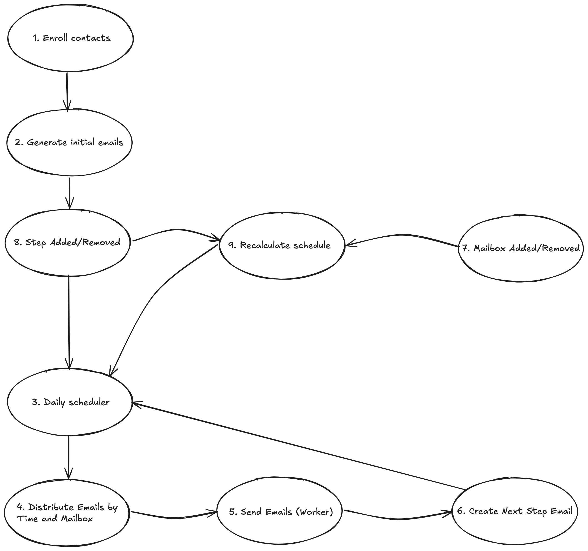

# Theoretical task

## Overview

This system manages email sending via sequences with multiple steps. Each sequence can have many contacts enrolled and multiple mailboxes to distribute sending load. Each mailbox has a daily sending limit. Emails are scheduled based on:

- Wait days between steps,
- Daily sending hours (e.g., 09:00–17:00),
- Mailbox capacity limits.

Emails are distributed evenly throughout the day and rescheduled if capacity is exceeded.

## Database schema

### ```sequences```

Defines a sequence of email steps.

- id
- name
- start_time (Start of daily sending window. e.g. 09:00)
- end_time (End of daily sending window. e.g. 17:00)

### ```steps```

Defines individual steps within a sequence.

- id
- sequence_id
- position (Order of the step in the sequence. e.g. 1, 2, 3 ...)
- wait_days (Days to wait after the previous step)
- subject
- content

### ```contacts```

Represents email recipients.

- id
- email

### ```enrollments```

Tracks which contacts are enrolled in which sequences and their current progress.

- id
- contact_id
- sequence_id
- enrolled_at (When the contact was enrolled)
- current_step_id (Last completed or current step)
- completed_at (When the sequence finished for this contact)

### ```mailboxes```

Represents sending mailboxes, with user ownership and daily limits.

- id
- user_id
- email
- daily_capacity (Maximum emails this mailbox can send daily)

### ```scheduled_emails```

Represents individual email sends that are scheduled for future delivery.

- id
- enrollment_id (Which enrollment this email belongs to)
- step_id (Which step this email belongs to)
- mailbox_id (Which mailbox is assigned to send this email)
- sent_at (Planned send time)
- status (pending, sent, failed, etc.)

## Implementation

### 1. Enrollment Phase

When a user enrolls contacts into a sequence:

- One ```enrollment``` is created per contact.
- The system immediately schedules the first email step (Step 1) for each contact.
- ```scheduled_emails``` records are generated with send_at = ```today``` (or next valid send date).
- These emails are initially marked as ```pending```.

### 2. Daily Scheduler Job

This job runs every day (e.g. at midnight or hourly) and performs:

#### a. Fetch All Pending Emails for Today

Pull all ```scheduled_emails``` where:

- ```status = 'pending'```
- ```send_at <= today```

#### b. Group Emails by Mailbox

- Group these emails by ```mailbox_id```.
- Respect each mailbox’s daily_capacity limit.
- If too many emails are assigned to one mailbox, only the first N are scheduled today, the rest are postponed.

#### c. Distribute Emails Throughout Sending Window

- Each sequence has a defined daily sending window (```start_time```, ```end_time```).
- Emails are distributed evenly across that window, per mailbox.
    - E.g. 30 emails between 9:00 and 17:00 → 1 email every 16 minutes.

#### d. Push Emails to the Sending Queue

- For each ```scheduled_email```, the system schedules a background job to trigger at the exact ```send_at``` time.

### 3. Sending Email (Worker Job)

When a background worker picks up a ```scheduled_email```:

- It sends the email using the assigned mailbox.
- On success, the status is updated to ```sent```.
- If the email belongs to a step that is not the final step, the next step is scheduled.

### 4. Create Next Step Email

After a step is successfully sent:

- The system checks if a next step exists.
- It calculates the next ```send_at``` date:
    - ```send_at = previous_step_sent_at + wait_days```
- A new ```scheduled_email``` is created for the next step.
- This email re-enters the scheduler flow (see Step 2).

> Note: If the wait day target is today, but the mailbox is already at capacity, the email is pushed to the next available day.


### 5. Handling Mailbox & Step Changes

#### When a mailbox is added or removed:

- The system **recalculates** future ```scheduled_emails```:
    - Adds more capacity if a new mailbox is added.
    - Redistributes or postpones if a mailbox is removed.

#### When a step is added, removed, or reordered:

- The system:
    - Updates future ```scheduled_emails``` accordingly.
    - Cancels old steps and reschedules based on the new step order and wait_days.

### 6. Recalculation Logic

- Rescheduling is performed asynchronously.
- Only pending future emails (```status = pending AND send_at > now```) are affected.
- Batched and throttled to support 50k+ contacts and 200+ mailboxes.

## Diagram


